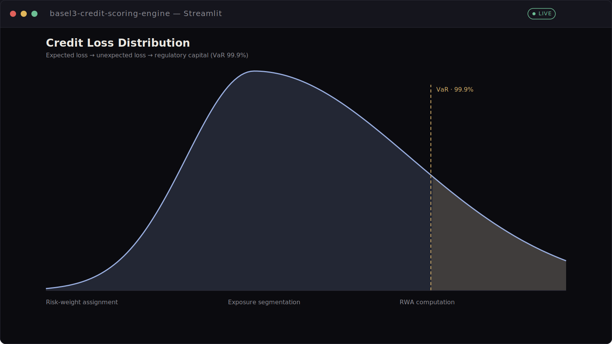
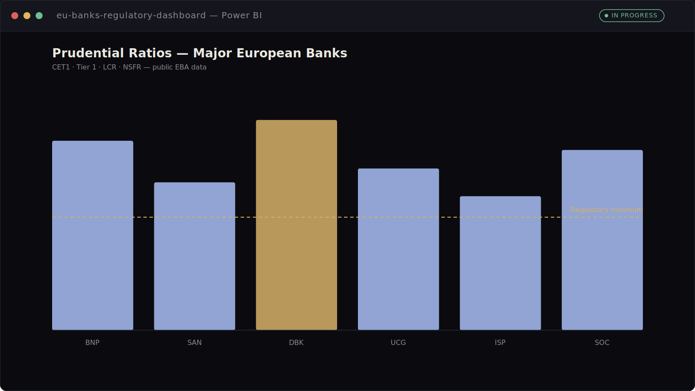
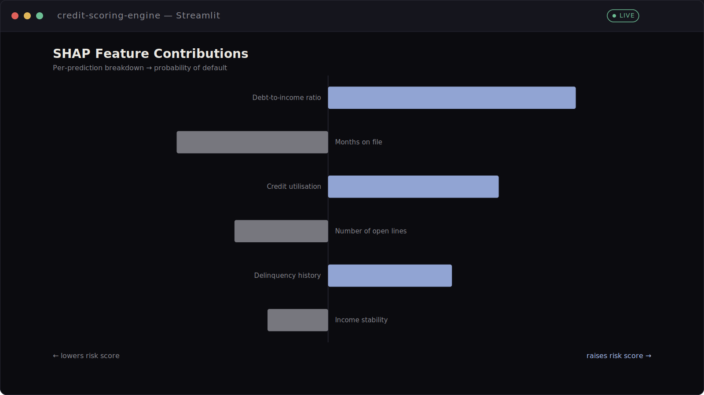

# Portfolio — Tristan Mas

Live site: [mastristan.github.io/portfolio](https://mastristan.github.io/portfolio/)

## About

Single-page portfolio for **Tristan Mas**, a Data & Business Analyst working across **Risk, Finance and Regulatory Data** (Basel III, NDoD, credit risk segmentation). The site is framed as a conversion-focused professional profile: a clear positioning statement, business-case-study project write-ups, and direct paths to the CV, GitHub and contact details.

Built with [Vite](https://vitejs.dev/) in vanilla JavaScript and modular CSS (no front-end framework). Bilingual (English/French), dark mode, accessible keyboard navigation, and orchestrated scroll/entrance animations that respect `prefers-reduced-motion`.

## Features

- **Bilingual content** (EN/FR) driven by a single translation-key system
- **Light/dark theme** toggle with persisted preference
- **Business case study project cards** (Context · Problem · Solution · Outcome) with tech-stack badges and an accessible screenshot lightbox (keyboard navigable, closes on `Esc`)
- **Professional snapshot** section summarising years of experience, projects delivered, technologies used and domains
- **Mobile navigation drawer** (hamburger menu) alongside the desktop side-nav, with 44×44px touch targets
- **SEO-ready**: meta description, Open Graph/Twitter cards, `Person` and `WebSite` JSON-LD, `sitemap.xml`, `robots.txt`
- **Accessible by design**: single `h1`, sequential heading structure, `aria-label`s on icon-only controls, visible focus states, reduced-motion fallbacks

## Tech stack

- [Vite](https://vitejs.dev/) — build tooling and dev server
- Vanilla JavaScript (ES modules) — component rendering, i18n, theming, motion/scroll behaviour
- Modular CSS with custom properties for theming — no CSS framework
- [PostCSS](https://postcss.org/) + Autoprefixer

## Screenshots

| Basel III Credit Scoring Engine | European Banks Regulatory Dashboard | XGBoost + SHAP Credit Scoring |
| --- | --- | --- |
|  |  |  |

These are stylised, branded previews (not literal app screenshots) generated by `scripts/generate-project-previews.mjs`, used as placeholders until real product screenshots are available.

## Getting started

```bash
npm install
npm run dev
```

Open the local URL printed in the terminal (default: `http://localhost:5173`).

### Available scripts

- `npm run dev` – start the Vite dev server with hot module replacement.
- `npm run build` – generate the production-ready `dist/` bundle.
- `npm run preview` – serve the built bundle locally to validate the final output.

## Project structure

```
├── public/                # Static assets copied as-is
│   ├── cv/                # PDF resume
│   ├── img/               # Images used throughout the portfolio
│   ├── robots.txt         # Crawler directives
│   ├── sitemap.xml         # Sitemap for search engines
│   └── og-card.png        # Social share card (Open Graph / Twitter)
├── scripts/                # One-off content generation scripts (project previews, OG card)
├── src/
│   ├── components/        # Section renderers (header, hero, about, snapshot, experience, skills, projects, contact, footer, …)
│   ├── data/              # Content sources (translations-en/fr.json, hero, about, experience, skills, projects, contact, navigation, languages)
│   ├── modules/           # Behavioural logic (theme, i18n, navigation, mobile nav, lightbox, animations, motion, scrollToTop, dom)
│   └── styles/            # Modular CSS imported via src/styles/main.css
├── index.html             # Vite entry point mounting src/main.js
├── postcss.config.js      # PostCSS configuration enabling Autoprefixer
└── vite.config.js         # Vite configuration with @ alias and chunk splitting
```

### Editing content

- **Translations** – update `src/data/translations-en.json` and `src/data/translations-fr.json`. Keys are shared across sections.
- **Projects & skills** – edit `src/data/projects.js` and `src/data/skills.js` to add or update entries.
- **Experience, contact & hero** – adjust `src/data/experience.js`, `src/data/contact.js` and `src/data/hero.js`.
- **Social share card** – regenerate `public/og-card.png` with `node scripts/make-og-card.mjs` (requires `sharp`).
- **Project preview images** – regenerate with `node scripts/generate-project-previews.mjs`.
- **Images/PDFs** – drop files into `public/` (they are served verbatim and referenced with relative paths such as `img/...`).

### Styling

Global styles are split into thematic files under `src/styles/` (variables, base rules, layout, utilities and per-section styling). All files are imported from `src/styles/main.css`, which is included by `src/main.js`.

## Deployment

The site is deployed to GitHub Pages via `.github/workflows/deploy.yml` on every push to `main`: it runs `npm ci`, `npm run build`, and publishes the `dist/` directory.

To deploy elsewhere:

1. Run `npm run build` to produce the `dist/` directory.
2. Deploy the contents of `dist/` to your hosting provider (static hosting such as Netlify, GitHub Pages, Vercel, etc. works out of the box).

## Quality targets

The site is built to meet the following Lighthouse thresholds:

| Category | Target |
| --- | --- |
| Performance | 90+ |
| Accessibility | 95+ |
| Best Practices | 95+ |
| SEO | 95+ |
